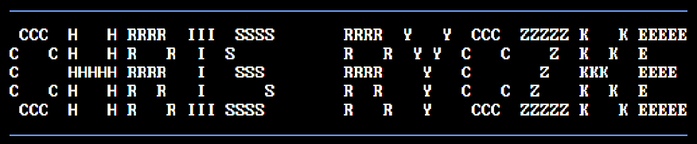

 
  
 
Welcome to the source code of my portfolio. Here, you will find both the publicly hosted website, along with its code, assets, and more.

## Website
The website is hosted under https://www.chrisryczke.com, where you can view the front-end side of my portfolio.

## Compiling

This portfolio was made with [React](https://react.dev/) and [Node.js](https://nodejs.org).

### Setup
To install Node.js, first run: `npm install`.

Then, to test the website, run: `npm run dev` to run it locally on your browser.

## Special Thanks
BigBlue Terminal Font - [VileR](https://int10h.org/blog/2015/12/bigblue-terminal-oldschool-fixed-width-font/)

# Copyright
Copyright (c) 2026 Snowman64, under the [GNU General Public License v3.0](https://www.gnu.org/licenses/gpl-3.0.en.html).